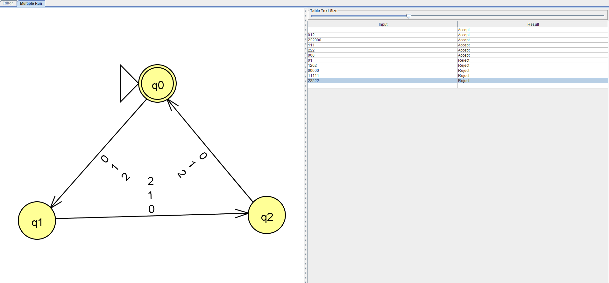
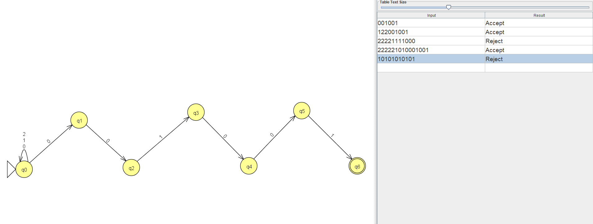
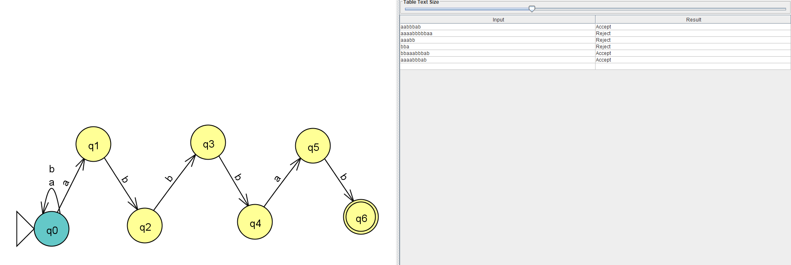
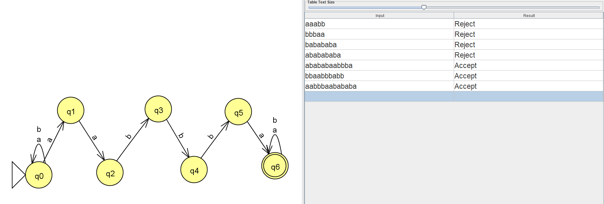
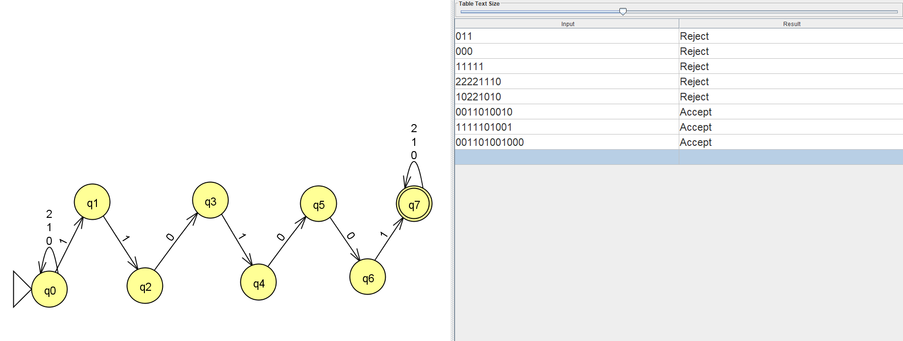

# Ejercicio 4. Automatas finitos en JFLAP

97. Las palabras de $\Sigma_1$ cuya longitud es un multiplo de 3.  

  

99. Las palabras de $\Sigma_1$ que terminan con la cadena 001001.  

  

102. Las palabras de $\Sigma_3$ que contienla cadena abbbab.  

  

103. Las palabras de $\Sigma_3$ que contienen la cadena aabbba.  

  

106. Las palabras de $\Sigma_1$ que incluyen la subcadena 1101001.  

  

